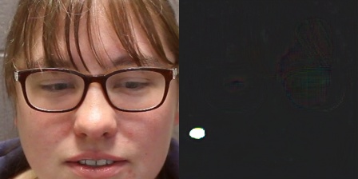
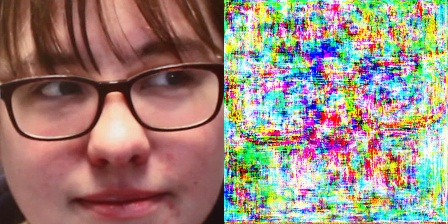

## Motivation
Package LGSC into a universal basic module for following research and projects

## Pipeline


## Result
The following pictures are randomly chosen from siw_release/test, their cue_spoof_score are ,  and .
<table style="border:0px">
   <tr>
       <td></td>
       <td></td>
       <td></td>
</table>

## Citation
```
@inproceedings{
    feng2020deep,
    title={Learning Generalized Spoof Cues for Face Anti-spoofing},
    author={Haocheng Feng and Zhibin Hong and Haixiao Yue and Yang Chen and Keyao Wang and
    Junyu Han and Jingtuo Liu and Errui Ding},
    year={2020},
    eprint={2005.03922},
    archivePrefix={arXiv},
    primaryClass={cs.CV}
}
```

## Reference
```
[1].https://github.com/VIS-VAR/LGSC-for-FAS
[2].https://github.com/Podidiving/lgsc-for-fas-pytorch
```